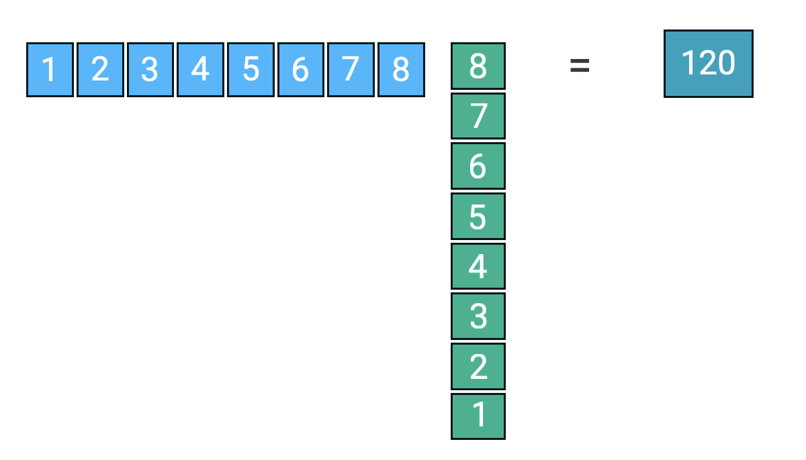
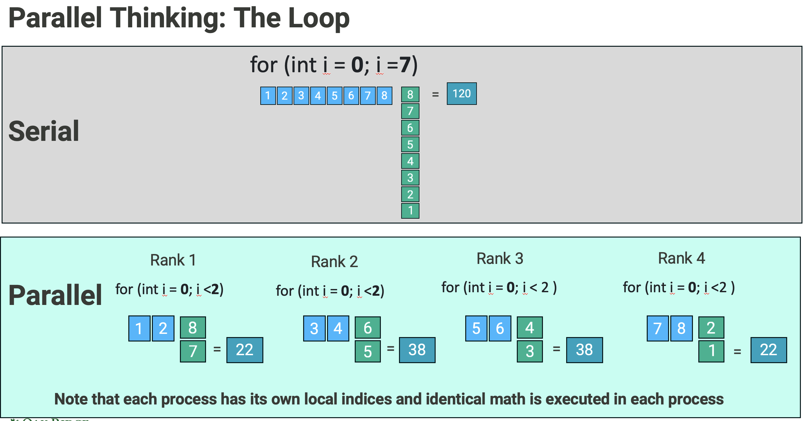

# Introduction to MPI and Parallel Computing

This 40-minute hands-on lesson introduces parallel thinking and the Message Passing Interface (MPI), a key tool in High Performance Computing (HPC).

You’ll learn how to:
- Break down a simple problem (the dot product) into parts that can run in parallel
- Write a serial version in C
- Turn it into a parallel version using MPI_Scatter and MPI_Reduce

By the end, you’ll see how MPI lets multiple processes work together using distributed memory parallelism—separate memory pools that communicate by sending messages.


## The Dot Product

<br>
<center>

</center>
<br>

We want to compute the dot product of two vectors `a` and `b` of size `N`:

dot = a[0]*b[0] + a[1]*b[1] + a[2]*b[2] + ... + a[N-1]*b[N-1]

With N=8 and vectors a and b: 

a = [1, 2, 3, 4, 5, 6, 7, 8]


b = [8, 7, 6, 5, 4, 3, 2, 1]


Total dot product:

  = 1\*8 + 2\*7 + 3\*6 + 4\*5 + 5\*4 + 6\*3 + 7\*2 + 8\*1
  = 120

Here is how that can be implemented in serial C code. 

## Serial C Code for Dot Product


```c
#include <stdio.h>           // Include standard input/output header for printf

#define N 1000               // Define a constant N = 1000, size of the arrays

int main() {
    double a[N], b[N], dot = 0.0;  // Declare arrays a and b of size N on the stack, and initialize dot to 0.0

    for (int i = 0; i < N; i++) {  // Loop over each index from 0 to N-1
        a[i] = i + 1;            // Fill array a with values
        b[i] = N - i;            // Fill array b with values
        dot += a[i] * b[i];        // Accumulate the product of a[i] and b[i] into dot
    }

    printf("Dot product: %f\n", dot);  // Print the final dot product result

    return 0;                    // Exit the program successfully
}

```

### Note on Serial and Parallel Execution  

- The loop above runs in serial, one iteration after the other.  
- However, the values computed in different iterations of the loop do not depend on each other.  
- This creates an easy opportunity to execute the iterations of the loop in parallel on different processors.  


## Memory Allocation in C  

C code allocates memory in two main ways: the stack and the heap.  
These are not physical locations in memory, but two different ways the C compiler and runtime manage memory.  

- **Stack**  
  - Fast, automatically managed memory for local variables.  
  - Size must be known at compile time.  
  - Memory disappears when the function ends.  
  - In the serial code above, the entire set of vectors is placed in a single pool of stack memory.  
  - Example stack allocation:  
   
    `double a[N], b[N];`
    

- **Heap**  
  - Flexible, manually managed memory for data that can change size or outlive a single function.  
  - Allocated at runtime using `malloc` and freed with `free`.  
  - We will use `malloc` in the parallel version of this code below.  

## Parallel Thinking

<br>
<center>

</center>
<br>
- Imagine our class is dividing the work of calculating a dot product.  
- Each person gets a "chunk" of the dot product to calculate, so most of the work can be done in parallel.  
- One person is then responsible for gathering all the chunks and adding the results together.  

Let’s say we have:  

- **N = 8** total elements to add  
- **P = 4** people (we’ll call these people processes since it helps with the transition to MPI later)  

To split the work evenly:  
'chunk_size = N / P = 8 / 4 = 2'

Each process will handle 2 elements of the dot product.  

We also organize our processes into ranks (process IDs) to make it easier for the gatherer to track them.  

| Rank (Process) | Global Index range |       Operation                  |
|----------------|--------------------|----------------------------------|
| Rank 1         | 0–1                | `a[0]*b[0] + a[1]*b[1]`          |
| Rank 2         | 2–3                | `a[2]*b[2] + a[3]*b[3]`          |
| Rank 3         | 4–5                | `a[4]*b[4] + a[5]*b[5]`          |
| Rank 4         | 6–7                | `a[6]*b[6] + a[7]*b[7]`          |

Each process computes its own **local dot product**, and then we combine all the local results into a single global value:


global_dot = local_Rank0 + local_Rank1 + local_Rank2 + local_Rank3

### Example With Real Values


| Rank | Elements            | Calculation  | local_dot |
|------|---------------------|--------------|-----------|
| 1    | a[0]b[0] + a[1]b[1] | 1×8 + 2×7    | 22        |
| 2    | a[2]b[2] + a[3]b[3] | 3×6 + 4×5    | 38        |
| 3    | a[4]b[4] + a[5]b[5] | 5×4 + 6×3    | 38        |
| 4    | a[6]b[6] + a[7]b[7] | 7×2 + 8×1    | 22        |

global_dot = 22 + 38 + 38 + 22 = 120


## The Parallel Dot Product Code

The Message Passing Interface (MPI) is a set of library functions, methods, and specifications that can be called to distribute a code's processing work between nodes or processors on the same node. It does this by passing messages between the processors. It is governed by a set of community driven standards. 

The next sections will walk you through the MPI functions and code that we have used to implement the dot product in parallel.
The code is given at the end of the explanation. 

The basic flow of MPI within in a program is:

- Initialize communication
- Communicate between processes to share data
- Exit the communication


## Initializing MPI  

The first thing MPI does when it is initialized is set up a communicator called `MPI_COMM_WORLD`.  

You can think of a communicator as a package that holds all the organizational information for its MPI region in the code. Inside the communicator:  
- Each process is given a rank (its unique ID).  
- The size of the communicator is equal to the total number of ranks.  

The part of the code that will be executed in parallel with an MPI communicator is called the MPI Region.  
It is always sandwiched between calls to `MPI_Init` and `MPI_Finalize`.  

All MPI function calls within the same MPI region get each process’s rank from the communicator.  
The programmer must use logic based on the rank ID to determine which code path each process follows.  


## MPI Scatter and Reduce 
The way we will implement the parallel dot product in the code below also uses two more MPI functions: MPI_Scatter and MPI_Reduce.  

- **MPI_Scatter**: Splits a large dataset into smaller chunks and sends one chunk to each process.  
  - Example: If you have 8 elements and 4 processes, each process gets 2 elements.  

- **MPI_Reduce**: A collective MPI operation that combines (reduces) values from all processes in a communicator using an operation (such as sum, max, min, etc.) and delivers the single result only to the root process.  

## Distributed Memory in Practice

For a typical MPI program, the number of ranks (processes) is set by the programmer in the run command, not in the code. This makes it easy to experiment with different numbers of processes without modifying the source.  

MPI is **distributed-memory parallelism**, which means MPI allows each process to work in its own pool of memory.  

This memory is usually allocated on the heap (using `malloc`). Heap allocation allows memory size to be determined at run time, so it can adjust automatically to the number of processes and the chunk size assigned to each.  

We *could* give every process a full copy of the arrays, but this wastes memory and requires unnecessary data transfers. Instead, MPI distributes only the needed chunks of the global arrays to each process.  

To make this work:  
- Each process has its own local arrays and local indices.  
- The global indices are mapped to local ones, so each process only handles its part of the data.  

## Work Division for Dot Product

| Index Range (Global) | Rank | Local Index | Operation (Global Index)  | Operation (Local Index)                             | Calculation  | Result |   
|----------------------|------|-------------|---------------------------|-----------------------------------------------------|--------------|--------|
| 0–1                  | 1    | 0, 1        | `a[0]b[0] + a[1]b[1]`     | `a_local[0] * b_local[0] + a_local[1] * b_local[1]` | 1×8 + 2×7    | 22     |
| 2–3                  | 2    | 0, 1        | `a[2]b[2] + a[3]b[3]`     | `a_local[0] * b_local[0] + a_local[1] * b_local[1]` | 3×6 + 4×5    | 38     |
| 4–5                  | 3    | 0, 1        | `a[4]b[4] + a[5]b[5]`     | `a_local[0] * b_local[0] + a_local[1] * b_local[1]` | 5×4 + 6×3    | 38     |
| 6–7                  | 4    | 0, 1        | `a[6]b[6] + a[7]b[7]`     | `a_local[0] * b_local[0] + a_local[1] * b_local[1]` | 7×2 + 8×1    | 22     |


Below is the code. Please read the comments in the code. There are other ways to implement this with MPI, but we have chosen this one to be as close to the parallel thinking example as possible. You will use this example to help you parallelize a vector addition code later in the tutorial. 


```c
#include <stdio.h>      // For printf
#include <stdlib.h>     // For malloc and free
#include <mpi.h>        // For MPI functions

#define N 10000000      // Total number of elements in each vector

int main(int argc, char** argv) {
    int rank, size;                     // rank = ID of the current process, size = total number of processes
    double *a = NULL, *b = NULL;        // These pointers will hold the full vectors (on rank 0 only)
    double local_dot = 0.0;             // Each process will compute a portion of the dot product
    double global_dot = 0.0;            // Final result of the full dot product (only meaningful on rank 0)

    // Initialize the MPI environment
    MPI_Init(&argc, &argv);

    // Set up to the MPI Communicator and get the
    // rank of the current process and the total number of processes
    MPI_Comm_rank(MPI_COMM_WORLD, &rank);
    MPI_Comm_size(MPI_COMM_WORLD, &size);

    // Calculate how many elements each process should handle N/P
    int chunk = N / size;

    // Allocate local arrays for this process to hold its chunk of data
    double *a_local = malloc(chunk * sizeof(double));
    double *b_local = malloc(chunk * sizeof(double));

    // Only rank 0 initializes the full vectors
   // We use malloc to get access to the heap memory, so each MPI process can allocate a chunk of data at runtime,
   // since stack arrays are limited in size and not suitable for dynamic, distributed work.
    if (rank == 0) {
        a = malloc(N * sizeof(double));   // Allocate memory for vector a
        b = malloc(N * sizeof(double));   // Allocate memory for vector b
        for (int i = 0; i < N; i++) {
            a[i] = i + 1;               // Fill vector a with sample values
            b[i] = N - i;               // Fill vector b with sample values
        }
    }

    // Distribute parts of vector a from rank 0 to all processes
    MPI_Scatter(a, chunk, MPI_DOUBLE,    // Send chunk elements from a
                a_local, chunk, MPI_DOUBLE,  // Receive chunk elements into a_local
                0, MPI_COMM_WORLD);      // Root is rank 0

    // Distribute parts of vector b similarly
    MPI_Scatter(b, chunk, MPI_DOUBLE,
                b_local, chunk, MPI_DOUBLE,
                0, MPI_COMM_WORLD);

    // Each process computes the dot product of its own local chunk using the local indices, 
    for (int i = 0; i < chunk; i++) {
        local_dot += a_local[i] * b_local[i];
    }

    // Reduce all local_dot values into global_dot on rank 0 using a sum operation
    MPI_Reduce(&local_dot, &global_dot, 1, MPI_DOUBLE, MPI_SUM, 0, MPI_COMM_WORLD);

    // Rank 0 prints the result
    if (rank == 0) {
        printf("Global dot product: %f\n", global_dot);
        free(a);   // Free full vectors on rank 0
        free(b);
    }

    // All processes free their local memory
    free(a_local);
    free(b_local);

    // Finalize the MPI environment
    MPI_Finalize();

    return 0;   // Exit the program
}


```
## Serial to Parallel

The table below shows the changes that we chose to go from serial to parallel. 


| **Serial Code** | **Parallel MPI Code** | **Explanation** |
|-----------------|------------------------|-----------------|
| `#define N 1000` | `#define N 10000000` | Define the problem size. In parallel, we chose N to be much larger, since the work is distributed. |
| `double a[N], b[N], dot = 0.0;` | `double *a = NULL, *b = NULL; double local_dot = 0.0, global_dot = 0.0;` | The serial code's arrays are allocated on the stack, though we could have allocated them dynamically. For the  parallel code, we chose dynamically allocated (heap) arrays so they can scale and be distributed at run time. A global and local dot variable are used. |
| `for (int i = 0; i < N; i++) {a[i] = . . b[i] = . . . dot+= . . .; }` | - Rank 0 initializes the full vectors `a` and `b` with malloc. <br> - `MPI_Scatter` distributes chunks of arrays to all processes (`a_local`, `b_local`). <br> - Each process computes its portion: `for (int i=0; i<chunk; i++) local_dot += a_local[i] * b_local[i];` | The serial loop does initialization and computation in one loop. In MPI, initialization is centralized on rank 0, then distributed. Each process computes only its slice of the work. |
| `dot += a[i] * b[i];` (inside loop) | `local_dot += a_local[i] * b_local[i];` | In parallel, each process keeps a local partial sum instead of the global sum. |
| `printf("Dot product: %f\n", dot);` | `MPI_Reduce(&local_dot, &global_dot, 1, MPI_DOUBLE, MPI_SUM, 0, MPI_COMM_WORLD); if (rank==0) printf("Global dot product: %f\n", global_dot);` | Instead of directly printing the result, MPI gathers all partial results and reduces them into a single global result on rank 0, which then prints. |
| `return 0;` | `MPI_Finalize(); return 0;` | Serial just exits. MPI must finalize the environment before exiting. |


## Hands-On Dot Product Exercise

For this exercise, we will time the parallel dot product code while it runs with different numbers of processors dividing the work. You will run it with 1, 2, 4, and 8 processes, timing each run to see how the performance changes.

A version of this code that allows you to set N (the number of elements) and NP (the number of MPI processes) from a batch script, and also includes code execution timing, is available here:

```
mpi_parallel/dot_product 
```

Follow the steps below to complete the code timing study:

### Steps

1. Change into the directory with the parallel dot product code:

   ```
   cd dot_product/
   ```

2. Compile the program 
   ```
   mpicc mpi_dot.c 
   ```
   
3. Open the batch script, `submit.sbatch` with an editor such as `vi`.

   ```
   vi submit.sbatch
   ```
   

4. Follow the instructions in the batch script to run the code with `NP` set to 1, 2, 4, 8, and 16.

   Once you edit the script and save it, you can submit the job by doing: 

   ```
   sbatch submit.sbatch
   ```
   When the job is finished you will see files that look like 

   `vec_add<job_number>.out`

   Use `less vec_add<job_number>.out` to see the content of the files and the execution time of program. 


5. Record the number of processors and the execution time for each run and note at what processor count the speedup levels off.

---

### Discussion Questions

- Remember that communication between processes adds overhead to code execution.  
  - Why might the code not continue to speed up as you add more processes?  


# Vector Addition - your turn! 


Now it’s your turn. We are going to perform a vector addition.

With N = 8, let’s define two vectors for a mental example just like we did for the dot product example:

a = [1, 2, 3, 4, 5, 6, 7, 8]
b = [8, 7, 6, 5, 4, 3, 2, 1]

The result vector c is computed element-wise:

c = a + b = [1+8, 2+7, 3+6, 4+5, 5+4, 6+3, 7+2, 8+1] = [9, 9, 9, 9, 9, 9, 9, 9]

Notice that each element of c is independent of the others, so the computation can be easily divided among multiple processes.


## Serial Code

Here is an example of the serial implementation:

```
#include <stdio.h>

#define N 8

int main() {
    double a[N], b[N], c[N];

    for (int i = 0; i < N; i++) {
        a[i] = i + 1 ;
        b[i] = N - i;
        c[i] = a[i] + b[i];
    }

    printf("Vector addition (first 5 results):\n");
    for (int i = 0; i < 5; i++) {
        printf("c[%d] = %f\n", i, c[i]);
    }

    return 0;
}
```

## Hands-On Serial to Parallel

There are a few different ways to make this code parallel with MPI. If you want to solve it in the same way that we showed for the dot product example, you can use the code below. You are welcome to try different methods too.  

Using Scatter and Gather Method 

## MPI Scatter and Gather 
The two MPI functions that may be useful for this are MPI_Scatter and MPI_Gather.  

- **MPI_Scatter**: Splits a large dataset into smaller chunks and sends one chunk to each process.  
  - Example: If you have 8 elements and 4 processes, each process gets 2 elements.  

- **MPI_Gather**: Collects data from all processes and assembles it back into a single dataset on the root process.  
  - Example: Each process computes a partial result, and `MPI_Gather` collects all of them into one array at the root.  


Parallelization Plan with MPI (Scatter and Gather)
- Initialize MPI.
- Determine the chunk size for each process: chunk = N / size.
- Allocate local arrays (a_local, b_local, c_local) on the heap.
- Scatter chunks of a and b to each process.
- Each process computes its local vector addition: c_local[i] = a_local[i] + b_local[i].
- Gather all c_local chunks back to the root process.
- Print results (rank 0).
- Free all heap memory.
- Finalize MPI.

# Vector Addition Exercise

Open a terminal and navigate to the `vector_addition` directory.  
Open `vec_add.c` in an editor (e.g., `vi`).  

Replace the sections marked `<TODO>` with the appropriate code.  
You may use this README and the code in the `Dot_Product` folder as references.  

When you’re finished editing, save the file and then:

---

## Step 1: Compile the program

```
mpicc vec_add.c 
```

## Step 2: Run the program

```
sbatch submit.sbatch
```
If you get stuck, you can check the solution at:

```
vector_addition/answers/vec_add_answers.c
```

# Final Thoughts

The two examples above are meant to show how MPI can be used to distribute different iterations of a loop across multiple processors. While both examples could easily be handled by a regular computer in serial, they help illustrate the type of parallel thinking required to use MPI. In real modeling and simulation codes, each process typically handles far more work than the simple arithmetic operations we used here.
